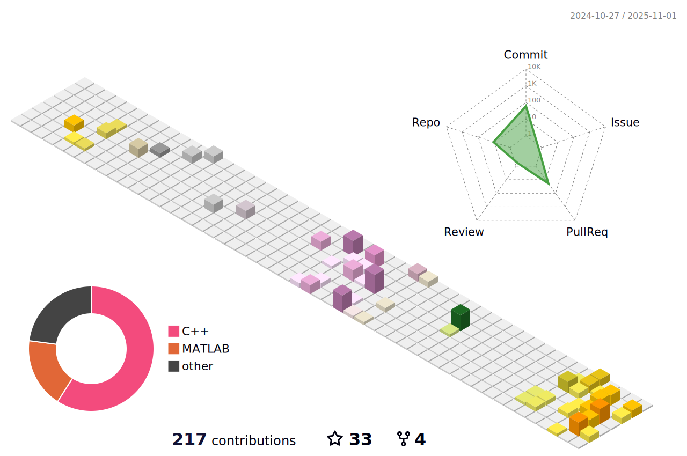

## Hi there 👋

<h1 align="center">Hi 👋, I'm Jialin Zhou</h1>
<h3 align="center">🚀 A passionate backend developer exploring many skills.</h3>

### 🧊 GitHub 3D Contribution Graph

### 📊 GitHub Stats

  
  &nbsp;&nbsp;&nbsp;&nbsp;&nbsp;
  

---

<!--
✨ _Special repository_ because its `README.md` appears on your GitHub profile.
-->
